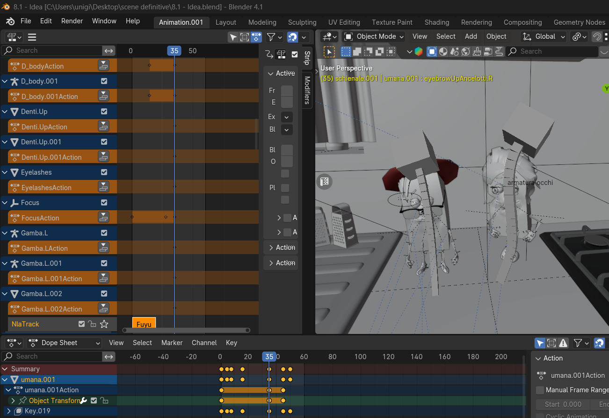
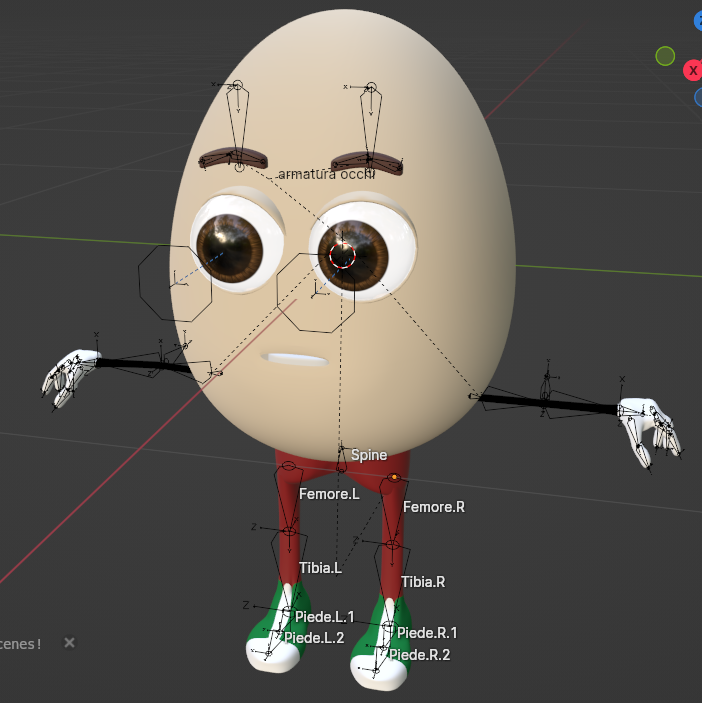
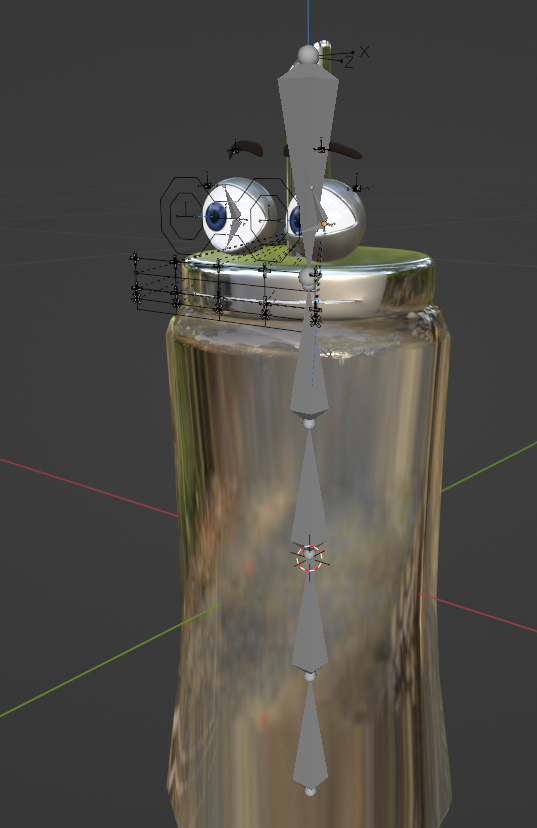

# 🎬 3D Ad Recreation - Blender Project

Repository for the final project of the **Computer Animation (01NPZYG)** course at **Politecnico di Torino** (A.Y. 2023/2024).

The goal of this project was to faithfully recreate the animation, lighting, timing, and composition of an existing YouTube commercial, entirely within **Blender**.

## 🎥 Final Result - Animation Preview

* 🔴 **[Watch the original commercial](https://www.youtube.com/watch?v=STCMcHzR2NY)**
* 🟢 **[Watch our recreated video in Blender](https://youtu.be/isHvfflwMAo)**

---

## ✨ My Contribution (Giovanna Rosace)
As this was a group project, I took on the role of a **3D Generalist**. I was responsible for setting up complex animation sequences, creating the main characters from scratch (modeling and rigging), and handling the set dressing of the scene. Specifically:

### 1. Character & Interaction Animation (Opening & "Idea" Scenes)
I fully animated the initial sequence (00:00 - 00:03), which required the simultaneous management of multiple characters (Egg, Cartons, Boxes) in a single shot. Additionally, I animated the key "Idea" sequence, where the human character interacts with the moving cake boxes. For both scenes, I worked extensively in the Graph Editor to replicate the dynamic pacing, character interactions, and the characteristic bounces of the original video.

### 2. Character Modeling & Rigging
To bring the products to life, I handled their technical and artistic creation:
*   **Character Modeling:** I modeled the main characters and "hero props" (like the Egg and the animated Carton) from scratch, optimizing their topology to allow for the necessary deformations during animation.
*   **Rigging:** I designed and implemented flexible facial rigging systems (eyes, pupils, and eyelids) and complete armatures (including limbs) to enable expressive poses and fluid movements.

  
  

### 3. Set Dressing & Layout
To reconstruct the environment (table, chairs) and fill the scene (tableware, gelatin box, cakes, cutting boards), I handled the research, optimization, and integration of pre-existing 3D models into Blender. I strategically positioned them to exactly replicate the framing, depth of field, and composition of the reference commercial.

### 4. Lighting & Look Development (Collaborative)
Together with the rest of the team, I actively participated in the study and setup of the lighting for the entire commercial. We worked in synergy to match the reflections, material specularity, and overall atmosphere with the cinematography of the original video, sharing feedback and adjustments.

---

## 👥 The Team & Workflow Breakdown
The project was developed by a team of 4 people. The management of lighting and final visual output was a collaborative effort, while to ensure a smooth pipeline.

*   **Giovanna Rosace** (Me)
*   **Salvatore Giugliano**
*   **Lorenzo Pindinello**
*   **Federico**

---
*Disclaimer: This is an academic project for study and portfolio purposes. The rights to the original concept and commercial belong to their respective owners.*
